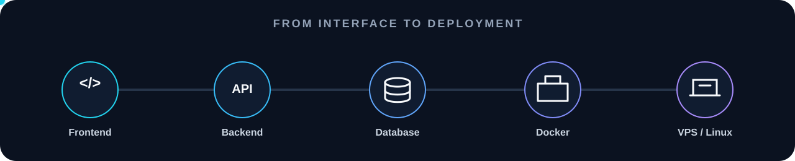
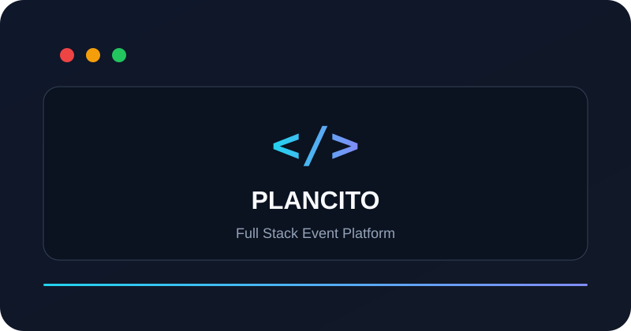
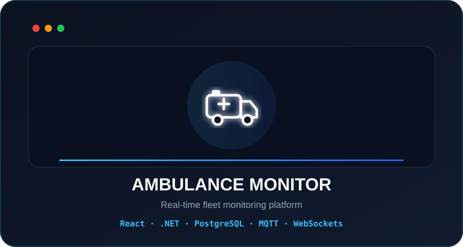
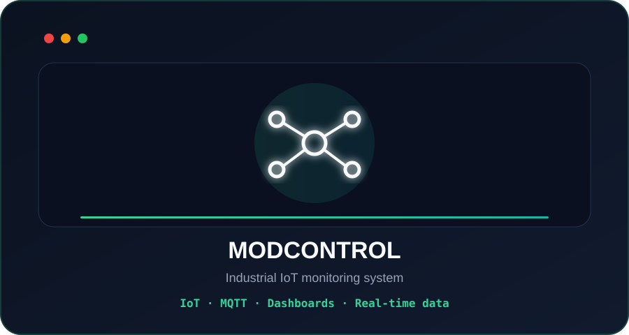
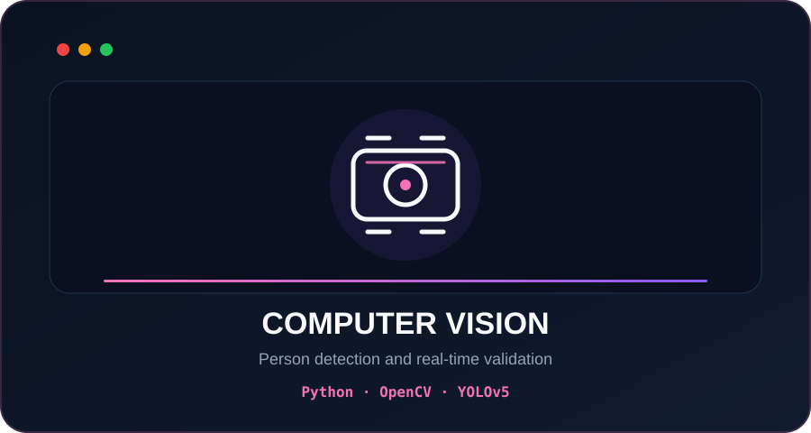

<picture>
  <source media="(prefers-color-scheme: dark)" srcset="./assets/banner-dark.svg">
  <source media="(prefers-color-scheme: light)" srcset="./assets/banner-light.svg">
  
</picture>

  
  
  

## Perfil

Desarrollador web orientado a **Full Stack**, con experiencia construyendo aplicaciones de extremo a extremo: interfaces, APIs, autenticación, bases de datos, integración en tiempo real y despliegue. Trabajo principalmente con **React / Next.js, NestJS, .NET, PostgreSQL y Docker**, además de Linux y VPS.

## Stack

  

## Cómo trabajo

  

## Proyectos destacados

<table>
  <tr>
    <td width="50%" valign="top">
      
      <h3 align="center">Plancito</h3>
      

        Plataforma web para descubrimiento y gestión de eventos, con frontend,
        backend, autenticación, administración de contenido y arquitectura modular.
      

      
<strong>Next.js · NestJS · PostgreSQL · Docker</strong>

    </td>
    <td width="50%" valign="top">
      
      <h3 align="center">Monitoreo de Ambulancias</h3>
      

        Plataforma para seguimiento de unidades móviles con comunicación en tiempo
        real, persistencia de datos y despliegue de la solución en VPS.
      

      
<strong>React · .NET · PostgreSQL · MQTT · WebSockets</strong>

    </td>
  </tr>
  <tr>
    <td width="50%" valign="top">
      
      <h3 align="center">MODCONTROL</h3>
      

        Sistema de monitoreo orientado a variables industriales, integración IoT,
        visualización de información y comunicación mediante MQTT.
      

      
<strong>IoT · MQTT · Dashboards · Real-time</strong>

    </td>
    <td width="50%" valign="top">
      
      <h3 align="center">Computer Vision</h3>
      

        Solución de detección de personas con entrenamiento y validación de modelos,
        procesamiento de video y pruebas con cámaras en tiempo real.
      

      
<strong>Python · OpenCV · YOLOv5</strong>

    </td>
  </tr>
</table>

## Enfoque técnico

  
  
  
  

## Contacto

  <strong>Full Stack Web Development · APIs · Databases · Real-time · Docker · VPS</strong>

  <a href="https://frankdeveloperxd.github.io/">Portfolio</a>
  ·
  <a href="https://www.linkedin.com/in/frank-yampierre-bernaola-pacheco">LinkedIn</a>
  ·
  <a href="mailto:bernaola.p.frank@gmail.com">Email</a>

